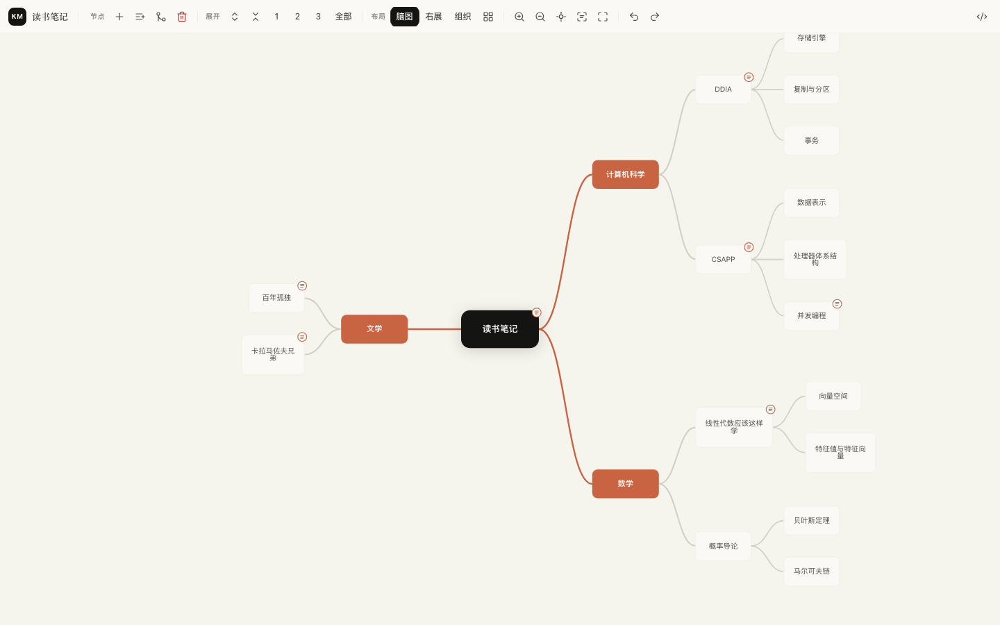
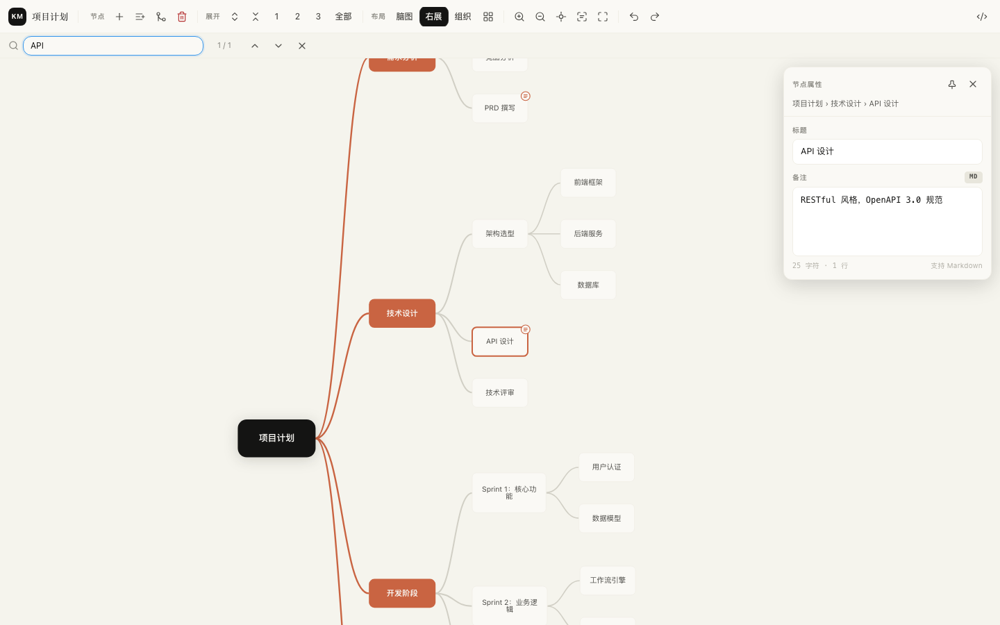

# KityMinder Neo

[English](README.md) | [简体中文](README.zh-CN.md)

KityMinder Neo 是一个用于查看和编辑 [fex-team/kityminder](https://github.com/fex-team/kityminder) `.km` 思维导图文件的 VS Code 扩展，适用于百度脑图文件。它默认保留 `.km` 文件在 VS Code 中的 JSON 文本编辑和 diff 流程，只在你明确需要时打开可视化导图编辑器。

扩展也支持导入 `.xmind` 文件并转换为 `.km`，并可从可视化编辑器导出 `.png`、`.svg` 或 `.xmind`。

## 界面截图





## 功能

- 默认使用 VS Code 标准文本编辑器打开 `.km` 文件，只有明确选择时才进入可视化编辑器。
- 保留 Source Control 和文件比较中的 JSON diff 体验。
- 可从资源管理器、编辑器标题菜单或命令面板打开 `.km` 可视化编辑器。
- 添加子节点、同级节点、父节点；删除节点及其子树。
- 支持节点标题行内编辑，也可以在节点属性面板中编辑标题。
- 拖拽节点以调整同级顺序，或移动到另一个父节点下。
- 复制、剪切、粘贴子树，支持跨文件；粘贴普通文本会创建子节点。
- 支持脑图、右展、组织结构三种布局。
- 展开或收起当前节点，全部展开，或展开到 1、2、3 级。
- 支持放大、缩小、居中、适应画布和可读视图。
- 搜索节点标题和备注；命中折叠节点时会自动展开其祖先节点。
- 在节点属性面板中编辑 Markdown 备注。
- 在有备注的节点上显示备注标记，并通过更安全的 Markdown 渲染路径预览备注。
- 可从可视化编辑器打开当前 `.km` 的源 JSON。
- 可从可视化编辑器导出 PNG、SVG 或 XMind。
- 支持最多 50 步撤销和重做。
- 导入 `.xmind` 压缩包，并对不支持的 XMind 特性给出提示。
- 对 `.km` 和 `.xmind` 输入做文件大小、节点数和树深度限制。
- 可在保存时规范化展开状态，减少不必要的 git diff。

## 安装

在 VS Code 扩展面板中搜索 **KityMinder Neo**，或使用命令行安装：

```bash
code --install-extension whynpc9.vscode-kityminder-neo
```

## 快速开始

1. 像普通文件一样打开 `.km`，查看或比较它的原始 JSON。
2. 通过以下入口打开可视化编辑器：
   - 资源管理器右键 `.km` 文件，选择 **Open Mindmap Editor**。
   - 编辑器标题菜单中选择 **Open Mindmap Editor**。
   - 命令面板运行 **KityMinder Neo: Open Mindmap Editor**。
3. 点击节点即可选中，在节点属性面板中编辑标题和 Markdown 备注。
4. 双击节点或按 `F2` 可以行内编辑标题。
5. 按 `Tab` 添加子节点，按 `Enter` 添加同级节点。
6. 在资源管理器中右键 `.xmind` 文件，选择 **Import XMind to KM** 进行导入。
7. 在可视化编辑器中点击导出按钮；PNG 和 SVG 可选择透明、白色或自定义十六进制背景。

## Diff 行为

KityMinder Neo 默认不会替换 VS Code 对 `.km` 文件的文本编辑和 diff 体验。

- 从 Source Control 打开 `.km` 时保持标准 JSON diff 视图。
- 常规打开 `.km` 文件时也保持文本编辑器，除非你明确选择思维导图编辑器。
- 如果 custom editor 接收到 git 虚拟文档或当前文本 diff 的某一侧，会自动回退到普通文本编辑器。

## 快捷键

| 快捷键 | 操作 |
|---|---|
| `Tab` | 添加子节点并开始编辑 |
| `Enter` | 添加同级节点并开始编辑 |
| `Delete` / `Backspace` | 删除选中节点及其子树 |
| `F2` | 行内编辑标题 |
| `Escape` | 取消编辑、关闭搜索或关闭节点面板 |
| `Space` | 展开或收起节点 |
| 方向键 | 在节点之间导航 |
| `Alt+Up` / `Alt+Down` | 在同级节点中调整顺序 |
| `Ctrl/Cmd+C` | 复制选中子树 |
| `Ctrl/Cmd+X` | 剪切选中子树 |
| `Ctrl/Cmd+V` | 粘贴为子节点 |
| `Ctrl/Cmd+Z` | 撤销 |
| `Ctrl/Cmd+Shift+Z` | 重做 |
| `Ctrl/Cmd+Y` | 重做 |
| `Ctrl/Cmd+F` | 搜索标题和备注 |
| `Ctrl/Cmd+=` 或 `Ctrl/Cmd++` | 放大 |
| `Ctrl/Cmd+-` | 缩小 |
| `Ctrl/Cmd+0` | 适应画布 |
| `Ctrl/Cmd+1` | 可读视图 |

## 配置

| 配置项 | 默认值 | 说明 |
|---|---|---|
| `kityminderNeo.saveExpandState` | `preserve` | 控制保存 `.km` 文件时如何写入节点展开和收起状态。 |

`saveExpandState` 可选值：

| 值 | 行为 |
|---|---|
| `preserve` | 保留当前展开和收起状态。 |
| `expandAll` | 保存为全部展开，移除 `expandState`。 |
| `level1` | 保存为展开到第 1 级。 |
| `level2` | 保存为展开到第 2 级。 |
| `level3` | 保存为展开到第 3 级。 |

除 `preserve` 外的值只会影响保存后的 JSON。编辑过程中仍可自由展开和收起节点。

## 开发

```bash
npm install
npm run build
```

在 VS Code 中按 `F5` 启动 Extension Development Host。

运行主要检查：

```bash
npm run check
```

## 打包

创建本地 VSIX：

```bash
npm run package
```

发布到 Visual Studio Marketplace：

```bash
npm run publish:vsce
```

这要求 publisher 已创建，并且 `vsce` 已登录。

## 许可证

[MIT](LICENSE)
